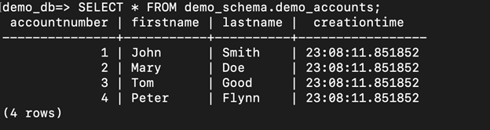

## Build a solution for data migration between on premises and Aurora databases hosted in private/non-routable VPCs using DMS

This solution demonstrates how to configure different AWS services to simulate customer environments consisting of DMS instances hosted on VPCs without direct network connectivity to on-premises and target networks. The objective is not to provide a deep dive on the services used, to act as a guideline on how to leverage these services to achieve alternate ways of VPC connectivity. Finally, to validate the architecture, we provide SQL statements to create sample database objects and insert data, and AWS CLI commands to migrate objects and data using AWS DMS. The AWS services used in our proposed architecture are:
- 3 VPCs (on-prem, DMS, and target)
- 2 Network Load Balancers (on-prem to DMS and DMS to target)
- 2 PrivateLink endpoints (on-prem to DMS and DMS to target)
- 2 Amazon Aurora PostgreSQL-Compatible Edition databases (on-prem and target)
- 2 AWS Secrets Manager database secrets
- 1 DMS instance
- 1 Elastic Cloud Compute (Amazon EC2) instance (migration workstation)

The solution is represented in the following diagram.

#### Architecture


### Requirements

- Access to [AWS Account](https://aws.amazon.com/premiumsupport/knowledge-center/create-and-activate-aws-account/)
- Terraform has been [configured](https://git-scm.com/book/en/v2/Getting-Started-Installing-Git) with AWS
- IAM User or IAM role with permissions to create AWS Resources.
- Clone this repo! : `git clone https://github.com/aws-samples/aws-dms-terraform.git`


### Privisioning the infrastructure

We can start deploying the infrastructure using the Terraform commands:

```
git clone https://github.com/aws-samples/aws-dms-terraform.git
cd privisioning
terraform init
terraform plan -out=tfplan -var-file="../variables/dev/common.tfvars.json"
terraform apply tfplan
```

The infrastructure creation takes around 5-10 minutes to complete.

### Solution Validation

To validate the environment, we just built using the Terraform modules, we perform a test migration using DMS. The workflow involves the creation of a set of tables on the source database, insertion of data records on the new tables, and finally the creation and run of the DMS migration task.

#### Prepare source database

1.	Using the PostgreSQL client (psql) in the bastion host, connect to the source database via the NLB VPC endpoint.

`psql -v sslmode="'require'" -h sourceVpcEndpoint -p 5432 -d postgres -U postgres`

2.	Next create a database, schema, and table objects.

```
CREATE DATABASE demo_db;
\c demo_db
CREATE SCHEMA demo_schema;
CREATE TABLE demo_schema.demo_accounts(
   accountNumber                BIGINT NOT NULL, 
   firstName                    VARCHAR(20),
   lastName                     VARCHAR(20), 
   creationTime                 TIME NOT NULL    
);
```

3.	Describe the table.

```
\dt+ demo_schema.demo_accounts
\d demo_schema.demo_accounts
```

The output must look similar to the one below:


4.	Insert sample records in the newly created table.

```
INSERT INTO demo_schema.demo_accounts VALUES 
(1,'John','Smith',current_timestamp),
(2,'Mary','Doe',current_timestamp),
(3,'Tom','Good',current_timestamp),
(4,'Peter','Flynn',current_timestamp);
```

The insert command returns an output similar to this:

`INSERT 0 4`

5.	Verify all the records were successfully created.

`SELECT * FROM demo_schema.demo_accounts;`

The output must look similar to the one below:



#### Prepare target database

Before we start the migration, we must create the target database used for the creation of the schema and objects associated with the migration. DMS does not create databases as part of the migration process. 

1.	Using the PostgreSQL client installed in the bastion host, connect to the target database via the target NLB VPC endpoint.

```psql -v sslmode="'require'" -h targetVpcEndpoint -p 5432 -d postgres -U postgres```

2.	Next, create the target database by running the following statement.

```CREATE DATABASE demo_db;```

#### Create DMS replication task

The DMS replication tasks are the core component of the database migration process, they contain all the metadata require to instruct DMS on how to perform the migrations. Therefore, before we begin with the creation of the replication task, lets create two JSON configuration files that will be used for the task settings and table mappings respectively.

1.	Create the task-settings.json file can be created using this sample JSON document:
```
{
  "TargetMetadata": {
    "SupportLobs": true,
    "FullLobMode": false,
    "LobChunkSize": 64,
    "LimitedSizeLobMode": true,
    "LobMaxSize":2048
  },
  "FullLoadSettings": {
    "TargetTablePrepMode": "TRUNCATE_BEFORE_LOAD",
    "MaxFullLoadSubTasks":16
  },
  "Logging": {
    "EnableLogging": true
  }
}
```

2.	Create the table-mappings.json using the following JSON document:
```
{
  "rules": [
    {
      "rule-type": "selection",
      "rule-id": "1",
      "rule-name": "1",
      "object-locator": {
        "schema-name": "demo_schema",
        "table-name": "demo_accounts"
      },
      "rule-action": "include",
      "filters": []
    }
  ]
}
```

3.	Next, we configure a few environment variables to store information such as Amazon Resource Names and the AWS region in which the resources are deployed.
```
export AWS_REGION=us-east-1
export sourceEndpointARN=$(aws dms describe-endpoints --region $AWS_REGION --filters Name=endpoint-type,Values=SOURCE --query 'Endpoints[0].EndpointArn' --output text)
export targetEndpointARN=$(aws dms describe-endpoints --region $AWS_REGION --filters Name=endpoint-type,Values=TARGET --query 'Endpoints[0].EndpointArn' --output text)
export dmsInstanceARN=$(aws dms describe-replication-instances --region $AWS_REGION --query 'ReplicationInstances[0].ReplicationInstanceArn' --output text)
export dmsRepTask=dms-task-demo
```

4.	Run the AWS CLI command to create a DMS migration task called "dms-task-demo".
```
aws dms create-replication-task --replication-task-identifier $dmsRepTask --source-endpoint-arn $sourceEndpointARN --target-endpoint-arn $targetEndpointARN --region $AWS_REGION --replication-instance-arn $dmsInstanceARN --migration-type full-load --table-mappings file://table-mappings.json --replication-task-settings file://task-settings.json --region $AWS_REGION
```

5.	Wait approximately 60 seconds for the task to be created and then run the DMS migration task.
```
export dmsRepTaskARN=$(aws dms describe-replication-tasks --filters Name=replication-task-id,Values=$dmsRepTask
--query "ReplicationTasks[*].ReplicationTaskArn" --output text)

aws dms start-replication-task --start-replication-task-type start-replication --replication-task-arn $ dmsRepTaskARN --region $AWS_REGION
```

6.	Monitor the migration task while it is running. You can run this command in a loop at different intervals.

```aws dms describe-replication-tasks --filters Name=replication-task-id,Values=$dmsRepTask --output table```

7.	Once the task has completed, connect to the target database using a PostgreSQL client.

```psql -v sslmode="'require'" -h targetVpcEndpoint -p 5432 -d demo_db -U master```

8.	Describe the target table to validate it is migrated successfully.
```
\dt+ demo_schema.demo_accounts
\d demo_schema.demo_accounts
```

The output must look similar to the one below:


9.	Finally, query the contents of the demo_schema.demo_accounts table to list all the records match the records stored in the source database.

```SELECT * FROM demo_schema.demo_accounts;```

The output must look similar to the one below:


If you require further details on [DMS configuration best practices](https://docs.aws.amazon.com/dms/latest/userguide/CHAP_BestPractices.html]), you can consult the AWS Documentation website. As always, once you are done with your testing, please make sure to use Terraform to delete all the services created and prevent future charges to your account.

### Clean up

Once you finish your test, please make sure to remove all the created resources, to avoid incurring in future costs. Run the following command to destroy all the objects managed by your Terraform configuration:

1. terraform destroy -var-file="../variables/dev/common.tfvars.json"

### Conclusion

In this post, we presented a solution for implementing communication among VPCs using VPC Endpoints and Network Load Balancers for performing database migrations using DMS in a secure and efficient way. We also provided all the required Terraform automation scripts and AWS CLI commands to provision the different AWS services, and SQL statements to create and query database objects. We encourage you to try this solution. As always, AWS welcomes your feedback, so please leave any comments below.


## Security

See [CONTRIBUTING](CONTRIBUTING.md#security-issue-notifications) for more information.

## License

This library is licensed under the MIT-0 License. See the LICENSE file.

